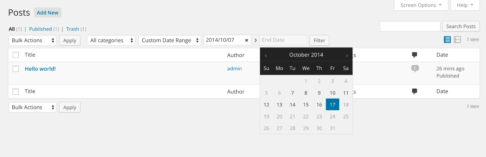
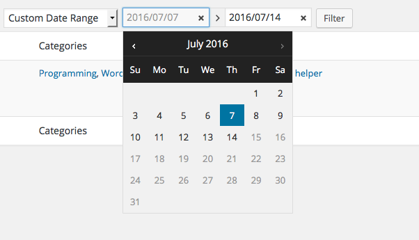
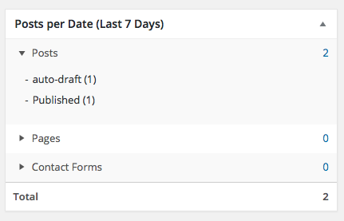
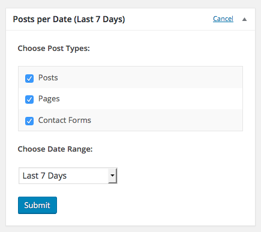

<!-- DO NOT EDIT THIS FILE; it is auto-generated from readme.txt -->
# Date Range Filter


Easily filter the admin list of post and custom post type with a date range.

**Contributors:** [jonathanbardo](https://profiles.wordpress.org/jonathanbardo), [lossonet](https://profiles.wordpress.org/lossonet), [stream](https://profiles.wordpress.org/stream)  
**Tags:** [date](https://wordpress.org/plugins/tags/date), [filter](https://wordpress.org/plugins/tags/filter), [admin](https://wordpress.org/plugins/tags/admin), [dashboard](https://wordpress.org/plugins/tags/dashboard), [widget](https://wordpress.org/plugins/tags/widget), [stats](https://wordpress.org/plugins/tags/stats)  
**Requires at least:** 3.7  
**Tested up to:** 4.7.1  
**Stable tag:** trunk (master)  
**License:** [GPLv2 or later](http://www.gnu.org/licenses/gpl-2.0.html)  

## Description ##

**Note: This plugin requires PHP 5.3 or higher to be activated. 5.4 Strongly recommended.**

A big shout-out to the [Stream](https://profiles.wordpress.org/stream/) team for developing much of the functionnality of this plugin and letting me reuse it for another purposes. You guys rock!

This plugin was develop to supercharge the current date filter of WordPress admin. It will let you filter posts by a custom date range or by an already defined range.

By default the plugin only filters post creation date. If you would like to filter the post modified date, please use this filter:
```php
function my_date_range_filter_query_column( $column ){
	return 'post_modified';
}
add_filter( 'date_range_filter_query_column', 'my_date_range_filter_query_column', 10, 1 );
```

**Languages Supported:**

 * English

**Improvement? Bugs?**

Please fill out an issue [here](https://github.com/jonathanbardo/WP-Date-Range-Filter/issues).

## Screenshots ##

### Filter posts list.



### Get a glance of post type count by date in the dashboard.



### Customize the date range of the dashboard widget.



## Changelog ##

### 0.0.11 ###
* Let user enter date manually for custom date range
* Add min js & css

### 0.0.10 ###
Fix compatibility with WooCommerce

### 0.0.10 ###
Fix compatibility with WooCommerce

### 0.0.9 ###
Fix some php 5.3 incompatibilities

### 0.0.8 ###
Add localization

### 0.0.7 ###
Fix a bug where calling public function would throw a fatal error

### 0.0.6 ###
Fix bug in dashboard widgets

### 0.0.5 ###
Add new dashboard widgets

### 0.0.4 ###
Allow select2 if present

### 0.0.3 ###
Add date range filter on media

### 0.0.2 ###
Add sanitization and plugin hooks

### 0.0.1 ###
Initial release. Props [Stream](https://profiles.wordpress.org/stream/)


